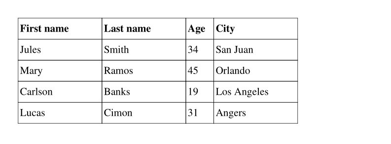
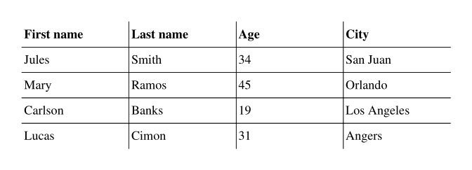
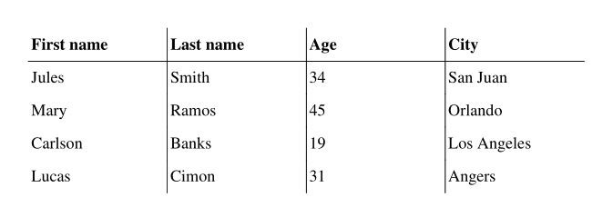

# Tables

Tables can be built using the `table()` method.
Here is a simple example:

```python
from fpdf import FPDF

TABLE_DATA = (
    ("First name", "Last name", "Age", "City"),
    ("Jules", "Smith", "34", "San Juan"),
    ("Mary", "Ramos", "45", "Orlando"),
    ("Carlson", "Banks", "19", "Los Angeles"),
    ("Lucas", "Cimon", "31", "Saint-Mahturin-sur-Loire"),
)
pdf = FPDF()
pdf.add_page()
pdf.set_font("Times", size=16)
with pdf.table() as table:
    for data_row in TABLE_DATA:
        with table.row() as row:
            for datum in data_row:
                row.cell(datum)
pdf.output('table.pdf')
```
Result:


## Features
* support cells with content wrapping over several lines
* control over column & row sizes (automatically computed by default)
* allow to style table headings (top row), or disable them
* control over borders: color, width & where they are drawn
* handle splitting a table over page breaks, with headings repeated
* control over cell background color
* control table width & position
* control over text alignment in cells, globally or per row
* allow to embed images in cells

## Setting table & column widths
```python
...
with pdf.table() as table:
    table.width = 150
    table.col_widths = (30, 30, 10, 30)
    ...
```
Result:



`table.align` can be used to set the table horizontal position relative to the page,
when it's not using the full page width. It's centered by default.

## Setting text alignment
This can be set globally, or on a per-column basis:
```python
...
with pdf.table() as table:
    table.text_align = "CENTER"
    ...
pdf.ln()
with pdf.table() as table:
    table.text_align = ("CENTER", "CENTER", "RIGHT", "LEFT")
    ...
```
Result:


## Setting row height
```python
...
with pdf.table() as table:
    table.line_height = 2.5 * pdf.font_size
    ...
```

## Disable table headings
```python
...
with pdf.table() as table:
    table.first_row_as_headings = False
    ...
```

## Style table headings
```python
...
with pdf.table() as table:
    blue = (0, 0, 255)
    grey = (128, 128, 128)
    table.headings_style = FontStyle(emphasis="ITALICS", color=blue, fill_color=grey)
    ...
```
Result:


## Set cells background
```python
...
with pdf.table() as table:
    table.cell_fill_color = 200  # grey
    table.cell_fill_logic = lambda i, j: i % 2
    ...
```
Result:


```python
...
with pdf.table() as table:
    table.cell_fill_color = (0, 0, 200)  # light blue
    table.cell_fill_logic = lambda i, j: j % 2
    ...
```
Result:


## Set borders layout
```python
...
with pdf.table() as table:
    table.borders_layout = "INTERNAL"
    ...
```
Result:



```python
...
with pdf.table() as table:
    table.borders_layout = "MINIMAL"
    ...
```
Result:



```python
...
pdf.set_draw_color(50)  # very dark grey
pdf.set_line_width(.5)
with pdf.table() as table:
    table.borders_layout = "SINGLE_TOP_LINE"
    ...
```
Result:


All the possible layout values are described there: [`TableBordersLayout`](https://pyfpdf.github.io/fpdf2/fpdf/enums.html#fpdf.enums.TableBordersLayout).

## Insert images
```python
TABLE_DATA = (
    ("First name", "Last name", "Image", "City"),
    ("Jules", "Smith", "shirt.png", "San Juan"),
    ("Mary", "Ramos", "joker.png", "Orlando"),
    ("Carlson", "Banks", "socialist.png", "Los Angeles"),
    ("Lucas", "Cimon", "circle.bmp", "Angers"),
)
pdf = FPDF()
pdf.add_page()
pdf.set_font("Times", size=16)
with pdf.table() as table:
    for i, data_row in enumerate(TABLE_DATA):
        with table.row() as row:
            for j, datum in enumerate(data_row):
                if j == 2 and i > 0:
                    row.cell(img=datum)
                else:
                    row.cell(datum)
pdf.output('table_with_images.pdf')
```
Result:


By default, images height & width are constrained by the row height (based on text content)
and the column width. To render bigger images, you can set the `table.line_height` parameter to increase the row height, or pass `img_fill_width=True` to `.cell()`:

```python
                    row.cell(img=datum, img_fill_width=True)
```
Result:


## Table from pandas DataFrame

_cf._ https://pyfpdf.github.io/fpdf2/Maths.html#using-pandas

## Using write_html

Tables can also be defined in HTML using [`FPDF.write_html`](HTML.md).
With the same `data` as above, and column widths defined as percent of the effective width:

```python
from fpdf import FPDF

pdf = FPDF()
pdf.set_font_size(16)
pdf.add_page()
pdf.write_html(
    f"""<table border="1"><thead><tr>
    <th width="25%">{TABLE_DATA[0][0]}</th>
    <th width="25%">{TABLE_DATA[0][1]}</th>
    <th width="15%">{TABLE_DATA[0][2]}</th>
    <th width="35%">{TABLE_DATA[0][3]}</th>
</tr></thead><tbody><tr>
    <td>{'</td><td>'.join(TABLE_DATA[1])}</td>
</tr><tr>
    <td>{'</td><td>'.join(TABLE_DATA[2])}</td>
</tr><tr>
    <td>{'</td><td>'.join(TABLE_DATA[3])}</td>
</tr><tr>
    <td>{'</td><td>'.join(TABLE_DATA[4])}</td>
</tr></tbody></table>""",
    table_line_separators=True,
)
pdf.output('table_html.pdf')
```

Note that `write_html` has [some limitations, notably regarding multi-lines cells](HTML.html#supported-html-features).
